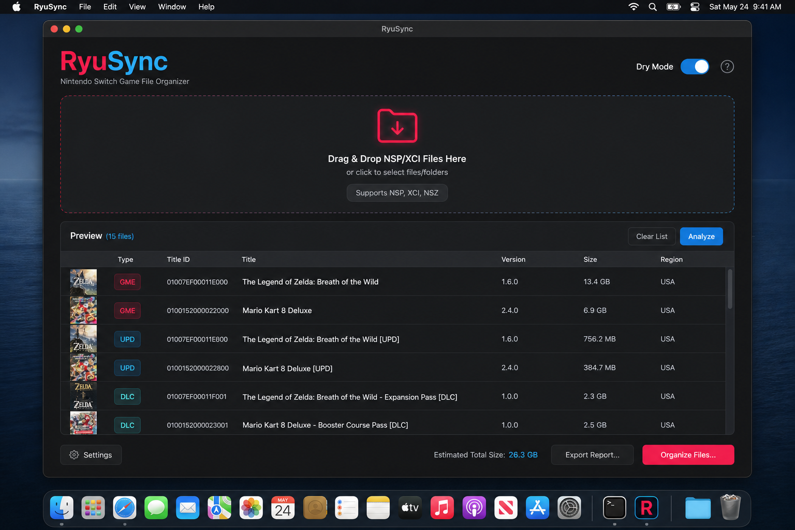

# RyuSync

[](https://github.com/RazorBackRoar/RyuSync/releases/latest)
[](https://github.com/RazorBackRoar/RyuSync/actions/workflows/ci.yml)
[](LICENSE)
[](https://www.python.org/)
[](https://doc.qt.io/qtforpython/)
[](https://support.apple.com/en-us/HT211814)

**Native macOS drag-and-drop organizer for Nintendo Switch `.nsp` / `.xci` files.**

Cleans titles, tags content as `[GME]`, `[UPD]`, or `[DLC]`, extracts archives in place, and supports a read-only Dry Mode preview before anything moves.

<p align="center">
  <a href="https://github.com/RazorBackRoar/RyuSync/releases/latest/download/RyuSync.dmg"><strong>↓ Download RyuSync.dmg</strong></a>
  ·
  <a href="https://github.com/RazorBackRoar/RyuSync/releases">All releases</a>
</p>



## Features

- **Drag-and-drop workflow** — drop a game file, folder, or archive onto the window
- **Smart title cleanup** — strips release noise (region tags, version markers, shop labels)
- **Content tagging** — labels files `[GME]`, `[UPD]`, or `[DLC]` from title ID metadata
- **Archive support** — extracts `.rar`, `.zip`, and `.7z` in place via `unar`; originals are preserved
- **Dry Mode** — previews the full organization plan without modifying files
- **Persistent settings** — dry-run preference and fuzzy-match threshold stored under Application Support
- **Native macOS UI** — dark PySide6 interface with red `#ff2d55` and blue `#00d0ff` brand accents
- **Apple Silicon native** — arm64 build optimized for M-series Macs

---

## Install

1. Download [`RyuSync.dmg`](https://github.com/RazorBackRoar/RyuSync/releases/latest/download/RyuSync.dmg)
2. Open the DMG and drag `RyuSync.app` to `/Applications`
3. First launch — right-click the app → **Open** to bypass Gatekeeper on the ad-hoc signed build
4. Install `unar` for archive extraction: `brew install unar`

---

## Usage

1. Open **RyuSync**
2. Toggle **Dry Mode** on to preview, or leave it off to organize immediately
3. Drag a `.nsp`, `.xci`, folder, or archive onto the window
4. Review the proposed folder layout and tagged filenames before confirming in Real mode

---

## Disclaimer

RyuSync is a file organization utility. It does not download, decrypt, stream, or distribute game files, and it does not circumvent technical protection measures. You are solely responsible for ensuring you have the legal right to possess any files you organize with this software.

---

## Development

### Requirements

- Python 3.14
- macOS 12.0+
- [uv](https://github.com/astral-sh/uv)
- [`unar`](https://theunarchiver.com/command-line) for archive extraction during local testing

### Setup

```bash
git clone https://github.com/RazorBackRoar/RyuSync.git
cd RyuSync
uv sync
uv run ryusync
```

Apps workspace developers can overlay editable `razorcore` from a sibling checkout:

```bash
uv pip install -e ../.razorcore --no-deps
```

### Build

```bash
razorbuild RyuSync
# Output: dist/RyuSync.dmg
```

See [docs/DMG_BUILD_README.md](docs/DMG_BUILD_README.md) for troubleshooting.

### Lint & Test

```bash
uv run ruff check .
uv run ty check src --python-version 3.14
uv run pytest tests/ -q
```

---

## Community & docs

- [BUILD_AND_RELEASE.md](BUILD_AND_RELEASE.md) — prerequisites, build, packaging, release, versioning
- [CONTRIBUTING.md](CONTRIBUTING.md) — how to contribute
- [SECURITY.md](SECURITY.md) — vulnerability reporting
- [CODE_OF_CONDUCT.md](CODE_OF_CONDUCT.md) — community standards

## License

MIT License — see [LICENSE](LICENSE) for details.
Copyright © 2026 RazorBackRoar

<!-- razorcore:runtime:start -->
## Runtime Requirements

For users:
- Download the macOS `.dmg` or `.app` release. Python does not need to be installed.
- `unar` must be installed separately for archive extraction (`brew install unar`).

For developers:
- Primary development/build target: Python 3.14 with `uv`.
- Source/build target: Python 3.14 only.
- Setup: `uv sync`
- Run: `uv run ryusync`
<!-- razorcore:runtime:end -->
